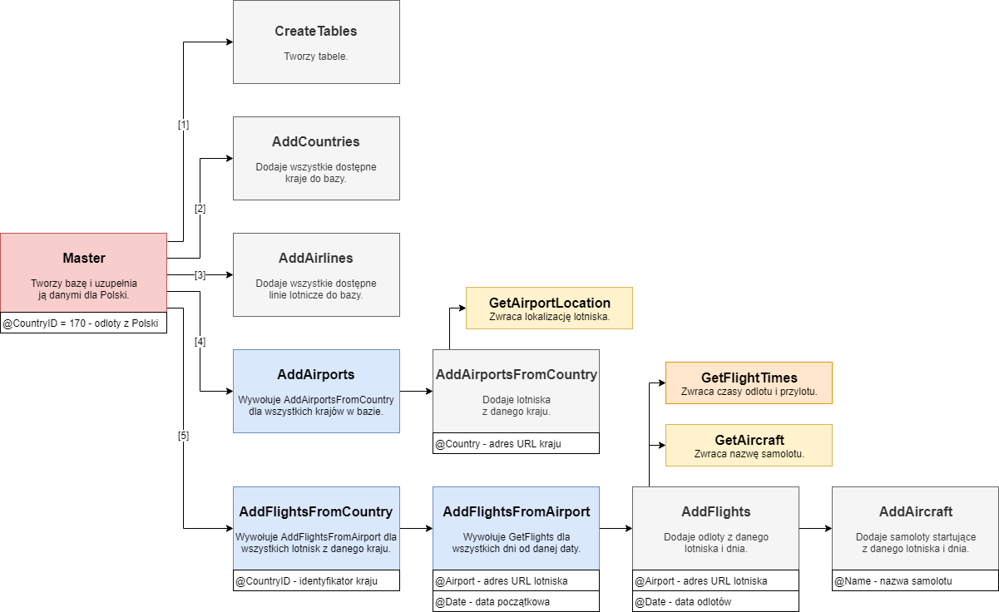

# Aircraft Tracker

To repozytorium zawiera projekt bazy danych stworzonej w SQL Server, która zawiera w sobie mechanizm pobierający dane o lotach samolotów z dowolnego kraju. W bazie danych zostały utworzone procedury do pobierania rozkładu lotów z lotnisk w danym kraju oraz ich późniejszej aktualizacji.

## Projekt

Rozwiązanie bazuje na procedurach składowanych i funkcjach, które trafią do lokalnej bazy danych (możesz to zmienić) za pomocą biblioteki [DbUp](https://dbup.github.io/). DbUp pozwala na modyfikację bazy danych z wykorzystanie skryptów napisanych w języku SQL.

Aplikacja została napisana jako aplikacja okienkowa, dzięki czemu po uprzednim skonfigurowaniu połączenia z bazą danych wystarczy naciśnięcie klawisza F5 aby na serwerze została utworzona w pełni funkcjonalna baza danych zawierająca wszystkie tabele, niezbędne procedury oraz funkcje.

## Struktura bazy danych

Struktura bazy danych opiera się na procedurach składowanych wspomaganych funkcjami skalarnymi i tabelarycznymi. Baza danych została przygotowana tak, aby możliwe było utworzenie jej schematu i pobranie danych za pomocą jednej procedury. Relacje między procedurami i funkcjami prezentuje poniższy diagram:


 
Opis poszczególnych elementów diagramu:

|  | Opis |
| --- | --- |
|  | główna procedura |
|  | procedura dodająca dane |
|  | procedura wykonująca procedury podrzędne w pętli |
|  | funkcja skalarna |
|  | funkcja tabelaryczna |

## Dane

W ostatnim kroku program spróbuje uzupełnić dane słownikowe w tabelach wykorzystując dostarczone pliki XML, jeśli zostały wcześniej pobrane. Zachęcam do importu danych z tych plików, ponieważ ich pobranie z wykorzystaniem utworzonych procedur jest czasochłonne. Udostępnione pliki XML zawierają dane wspólne dla każdego kraju.

Jeśli zdecydujesz się na własnoręczny import danych wystarczy, że wykonasz następujący kod:

``` SQL
EXEC dbo.AddCountries
EXEC dbo.AddAirlines
EXEC dbo.AddAirports
EXEC dbo.AddFlightsFromCountry @CountryID = N
```

gdzie `N` to ID kraju, z którego chcesz pobierać dane. Kod ten pobierze dane o lotach ze wszystkich lotnisk z danego kraju w dniu, w którym wywołasz kod. Możesz oczywiście zwiększyć zakres dat modyfikując zmienną `@Date` w procedurze `dbo.AddFlightsFromCountry`, aby pobrać dane archiwalne.

Możesz także pobrać rozkład lotów z dowolnego lotniska w dowolnym kraju wywołując procedurę `dbo.AddFlightsFromAirport`.

### Źródło danych

Rozkład lotów jest pobierany ze strony www.airportia.com, natomiast informacje o konkretnych maszynach obsługujących dany kurs są pobierane ze strony www.flightradar24.com. Informacja o maszynie lecącej na danej trasie jest dostępna do 7 dni wstecz.
